監控軟體
就不用手動查看機器有沒有出現問題了
server/client/proxy

client收集系統資訊
loading /Hardware status...
active/passive

passive -> monitor定期詢問

proxy(分公司)


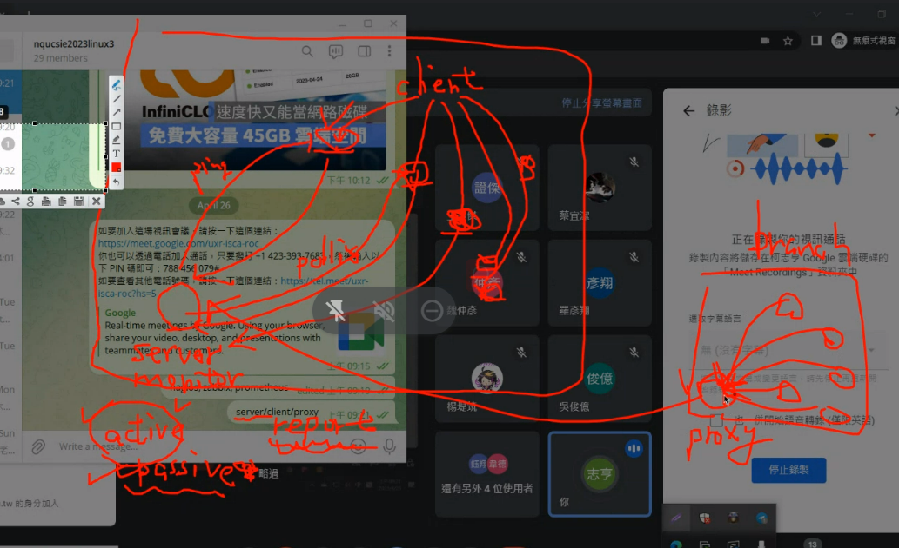  
proxy 代理人負責回報分公司資訊給Server monitor?

事件發生傳送email或Line
透過email信箱傳送信到其他信箱
## 發送email

> https://security.google.com/settings/security/apppasswords?pli=1
> 先產生密鑰

```
vi /etc/mail.rc

set smtp-use-starttls
set ssl-verify=ignore
set nss-config-dir=/etc/pki/nssdb/
#設定寄件者信箱
set from=smallko@gmail.com
 (http://from=smallko@gmail.com/)#設定Gmail_Smtp端口
set smtp=smtp://smtp.gmail.com:587
#設定Gmail_Smtp認證帳號
set smtp-auth-user=xxxx@gmail.com
 (http://smtp-auth-user=smallko@gmail.com/)#設定Gmail_Smtp認證帳號之密碼(請使用Google應用程式密碼)
set smtp-auth-password=xxxxxx
set smtp-auth=login
```

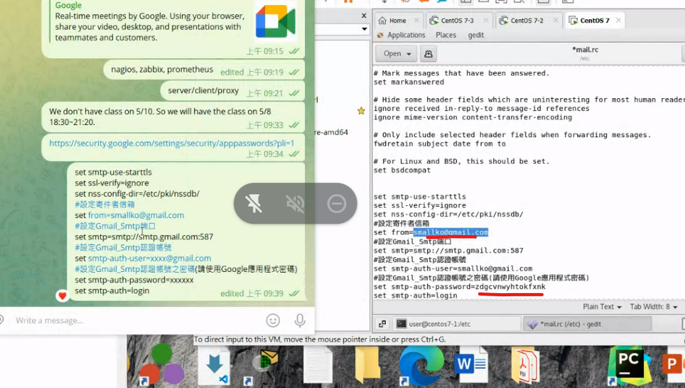  
紅色部分要更改
 

``` echo 內容 | mail -v -s "標題" 收信者email
```

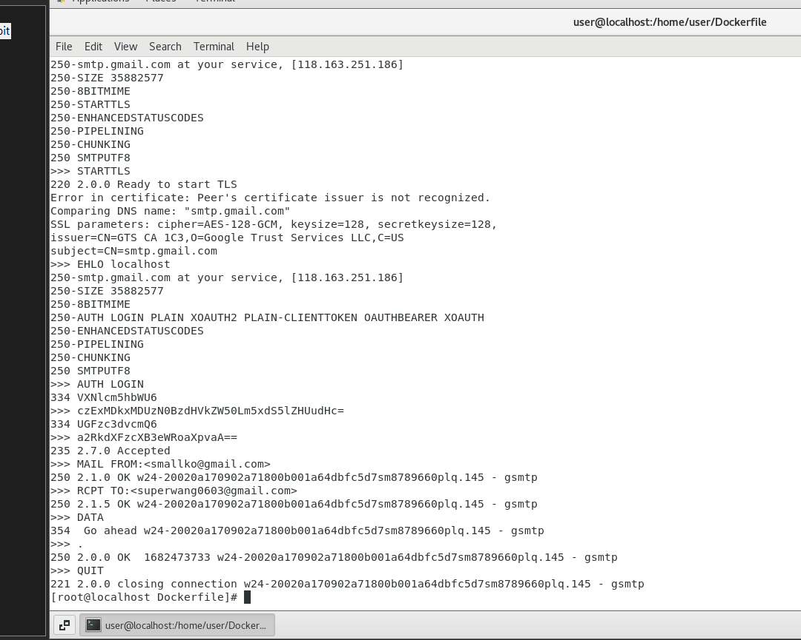  
> 貌似是發送出去了

---

```
[root@localhost Dockerfile]# setenforce 0
```
關閉selinux與 firewalld

照著教學做
> https://cloud.tencent.com/developer/article/1943154

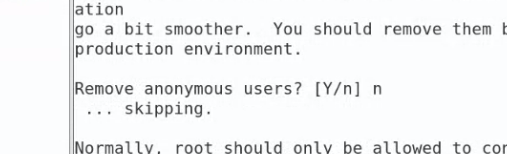  

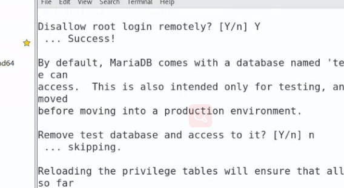  

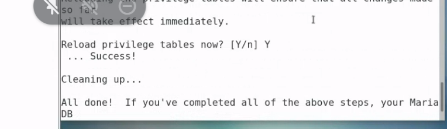  


 #mysql -uroot -p

Bash
```
create database zabbix_db character set utf8 collate utf8_bin;
create user zabbix@localhost identified by 'password';
grant all privileges on zabbix_db.* to zabbix@localhost;
quit;
```

```
zcat /usr/share/doc/zabbix-server-mysql*/create.sql.gz | mysql -uzabbix -p zabbix_db
```

可以連接資料庫後於Windows下載軟體
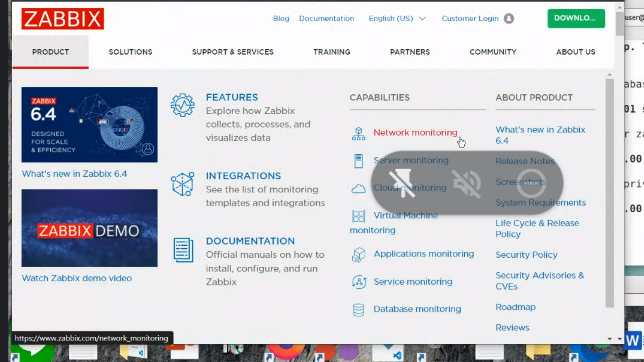  

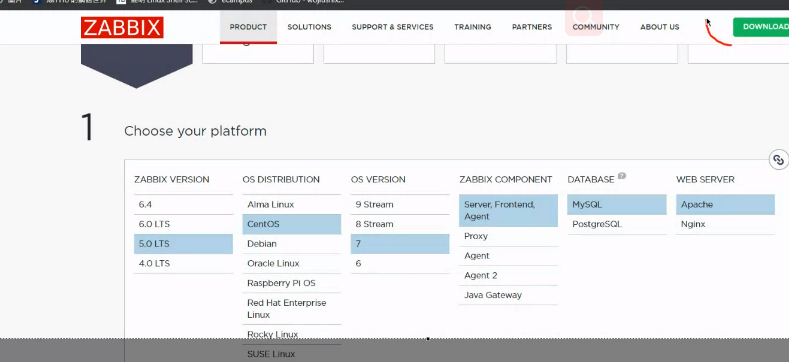  

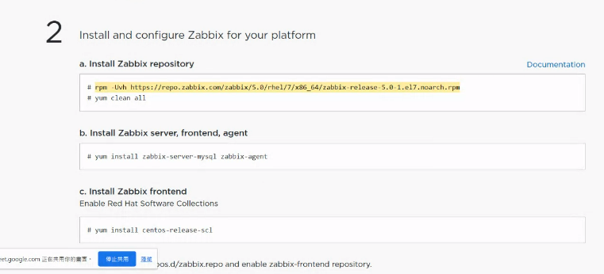  

他有告訴你怎麼安裝
為甚麼有時候需要yum clean all?

伺服器軟體與客戶端軟體都會安裝在同一台機器上

## 我覺得好像我裝到5.0以上的zabbix才會發生錯誤...

我重裝zabbox5.0根著做就好了
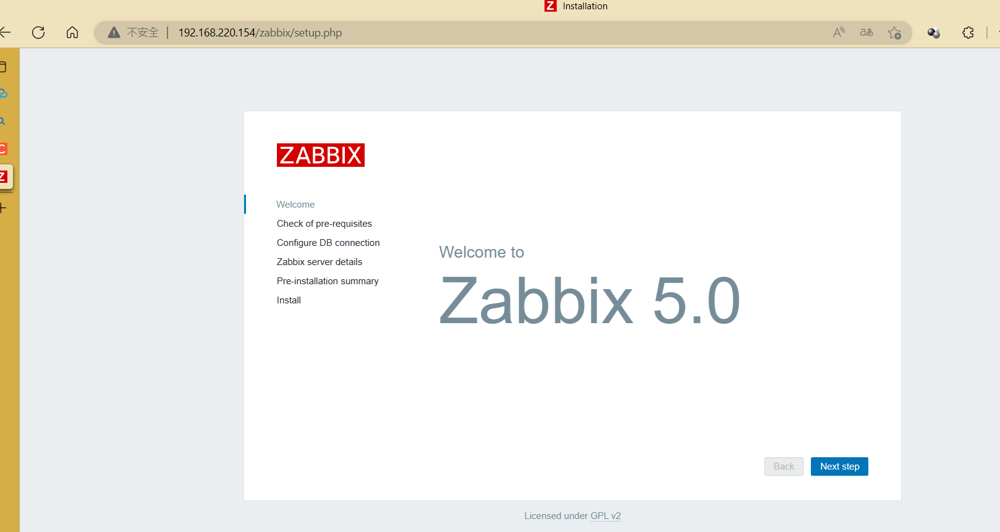  


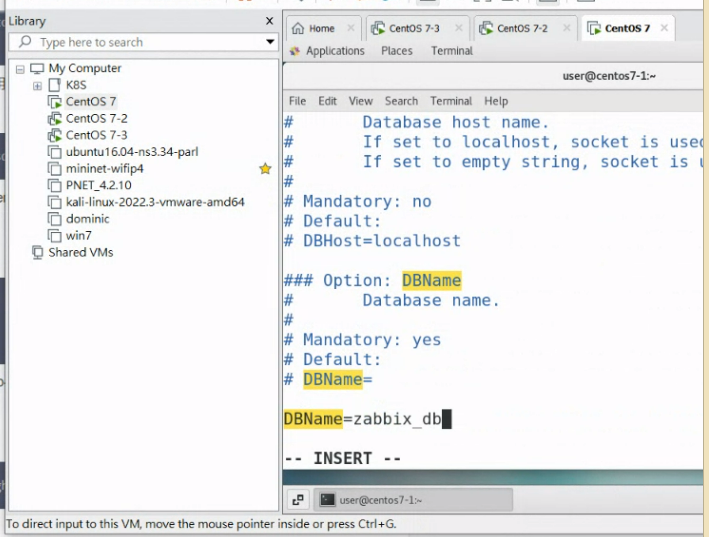  

加上
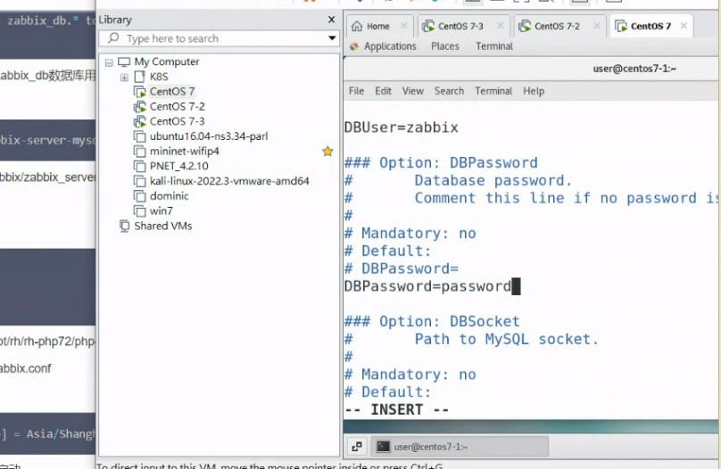  

修改時區
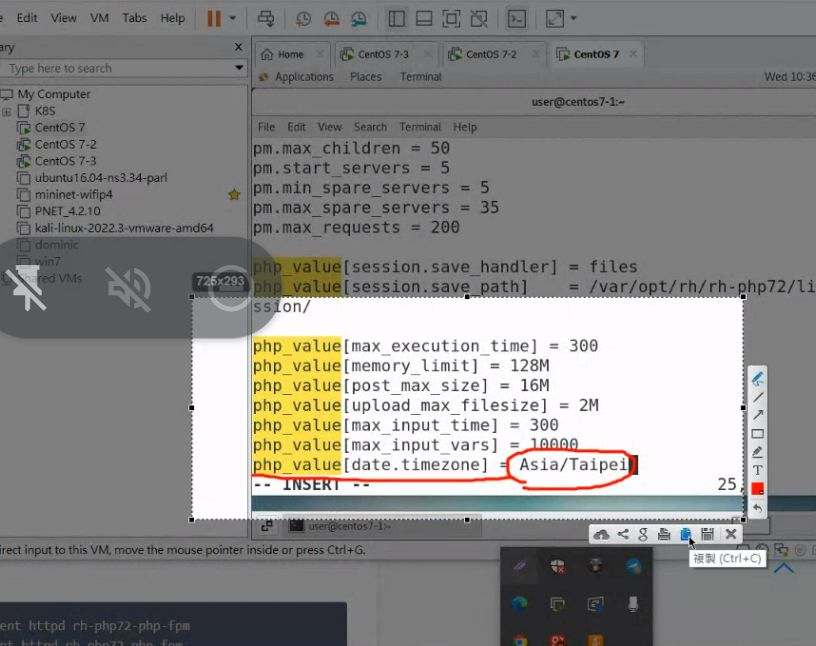  

訪問Zabbix
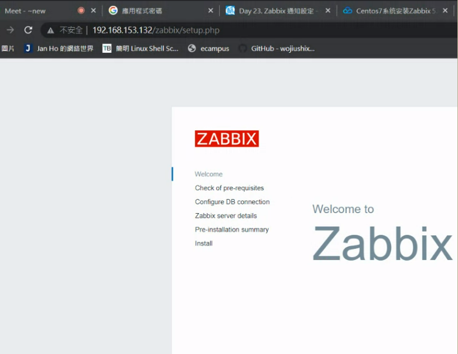  

Zabbix可以做甚麼?

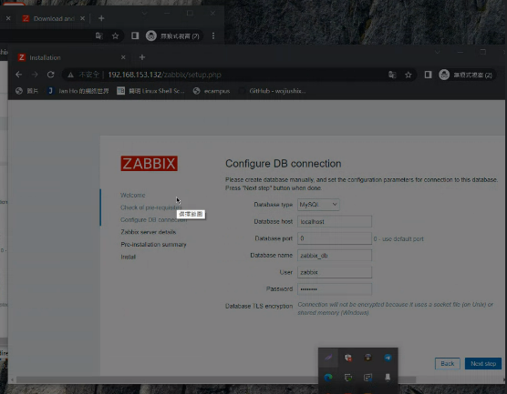  

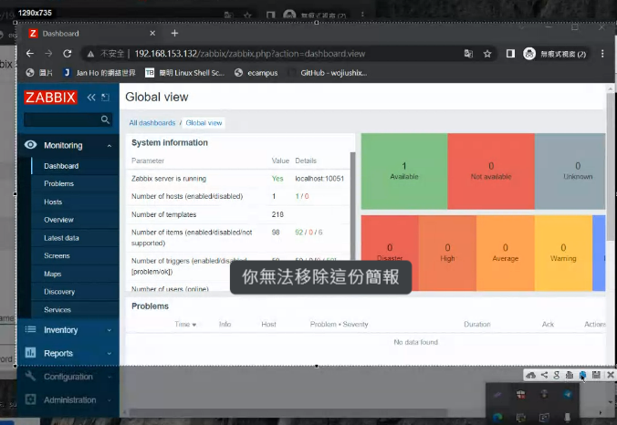  
> 進入管理畫面


vi /etc/zabbix/zabbix_server.conf 沒東西....

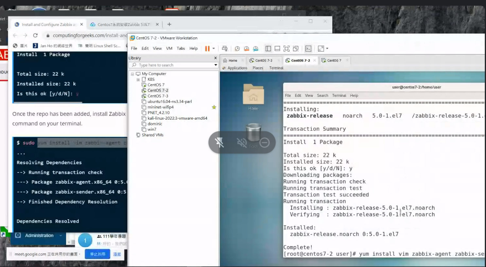  
> 兩台都要安裝

配置agent_conf

修改成自己的Server位置
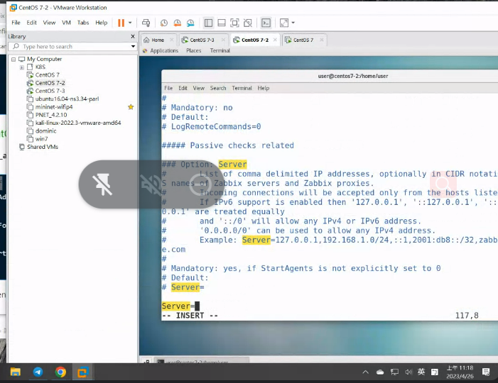  

ServerActive也要修改成自己的Ip位置 #要拿掉

HostName = centos7-2 (主機的名稱-根據你的主機而定)

7-2 與 7-3的配置檔都要修改

接著重新啟動agent
並設置enable
就是跟著教學做...

> https://computingforgeeks.com/install-and-configure-zabbix-agent-on-centos/

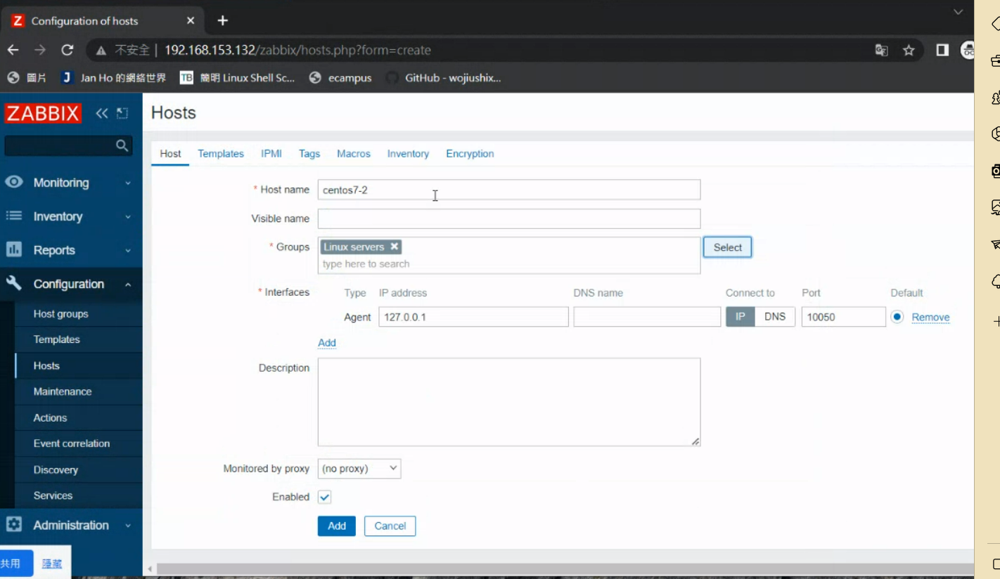  
> Agent 是7-2的ip

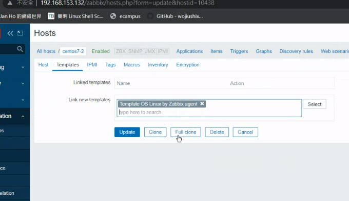  

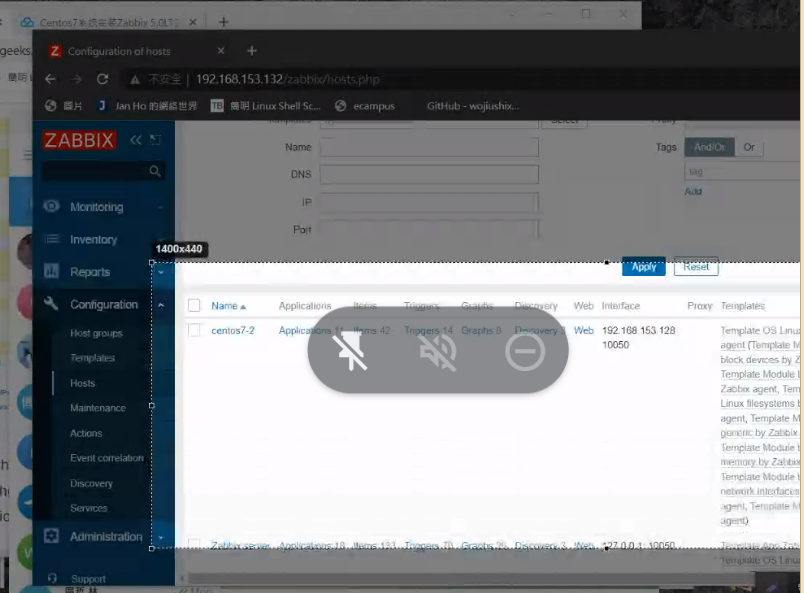  
> 就會出現centos 7-2 欄位是預設的監控項

繼續配置centos7-3 
但這樣不還是手動配置嗎?....有沒有自動化的方式


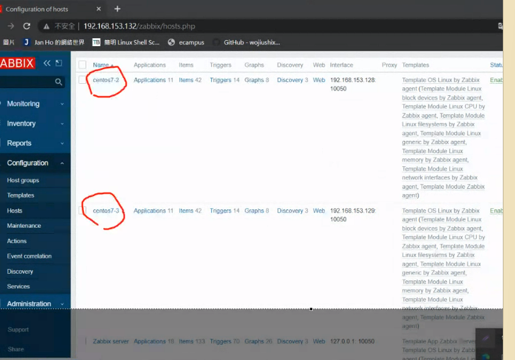  

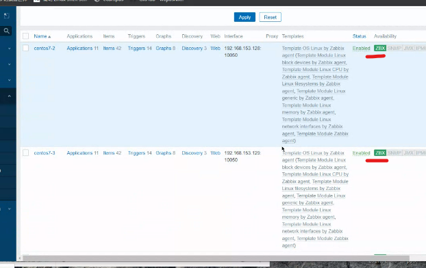  
> 做到這兩顆燈會亮起

手工測試
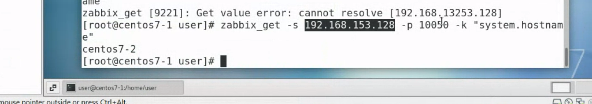
> 詢問主機一些相關資訊


