JumpServer

製作前要先啟動docker

Tutorial:
```
https://github.com/wojiushixiaobai/Dockerfile
```

  

設置堡壘機 使用者
  

設置asset
  

先設定Asset再設定user (Command User)

Permission要勾
  

  

凡走過必留下痕跡，JumpServer會記錄下我的惡行!!

查看操作影片
  

  

  

開啟docker compose之前當然要把docker 開啟
``` systemctl start docker```
selinux與 firewalld好像也要關掉

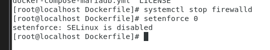  

建立mary 用戶

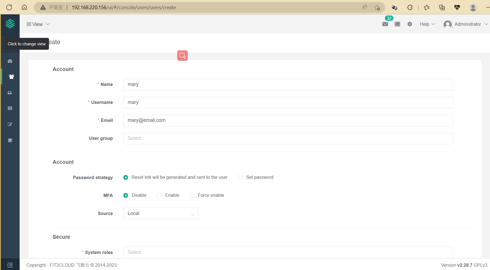  

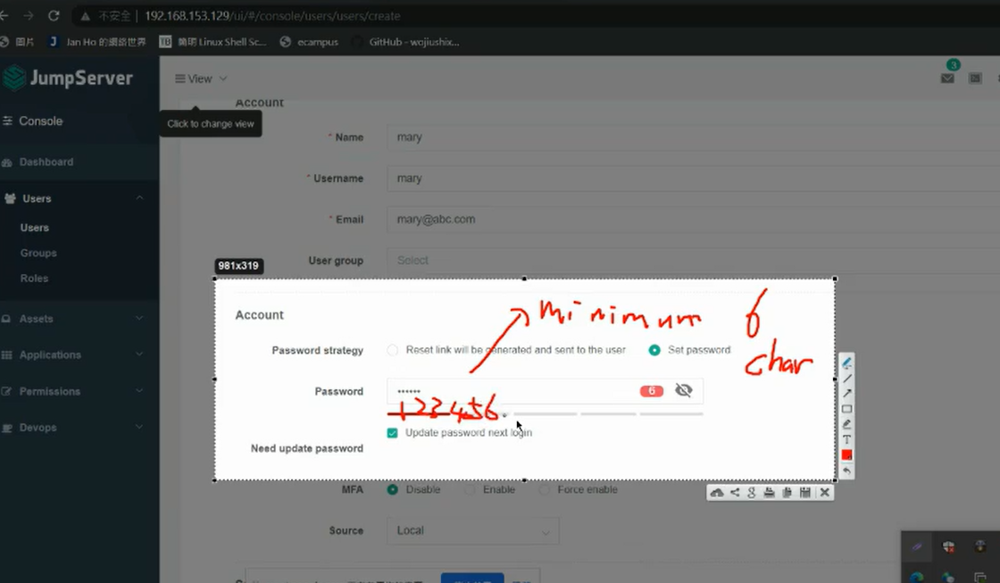  

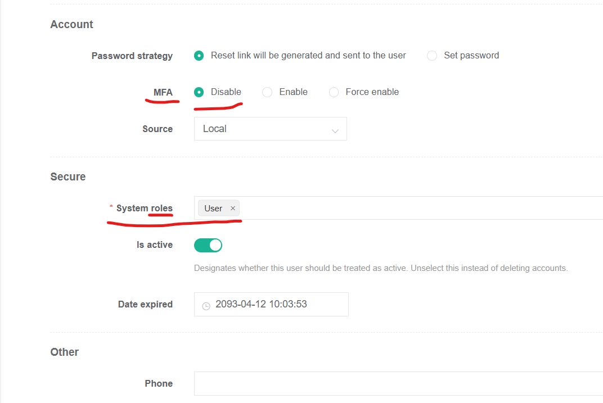  

之後創建Asset 與 common user

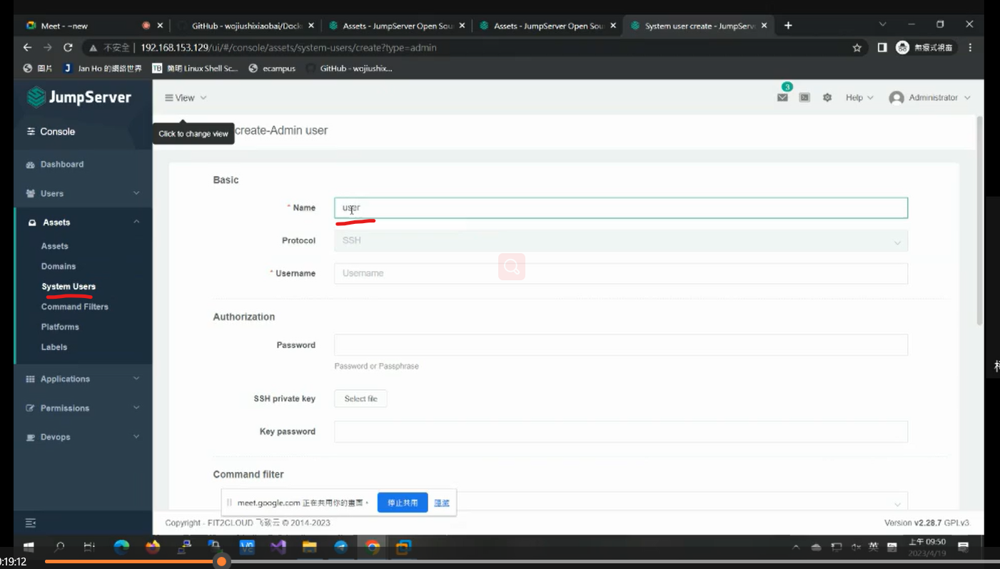  
> Name根據你的虛擬機用戶名來更改 這裡其實是Common-User

## Step3: Setting Permisson
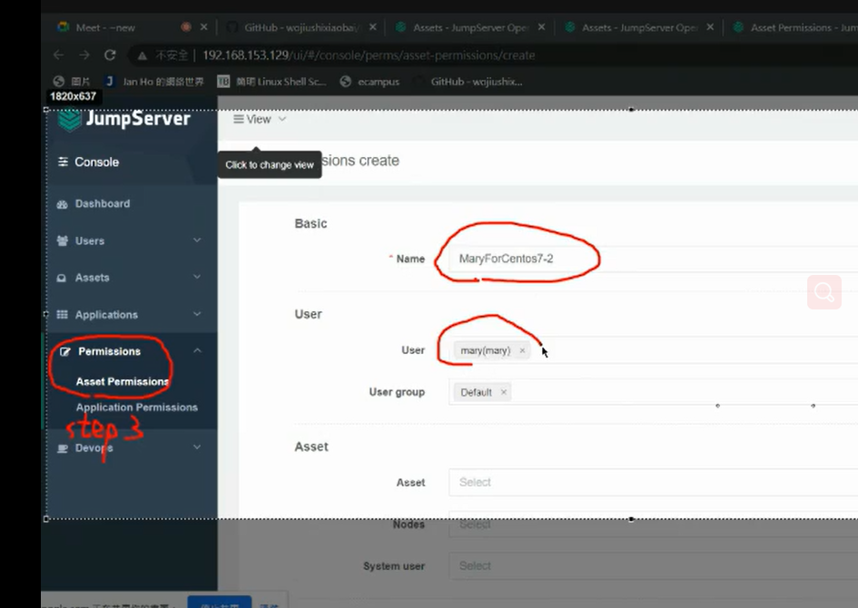  

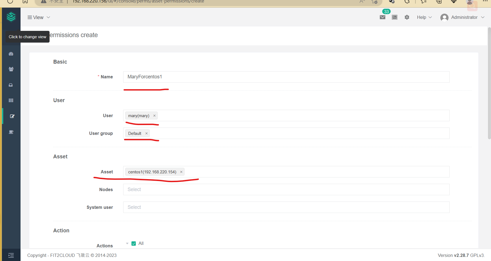  

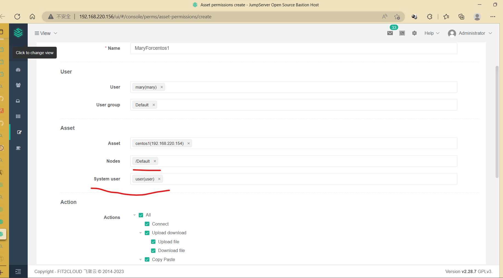  

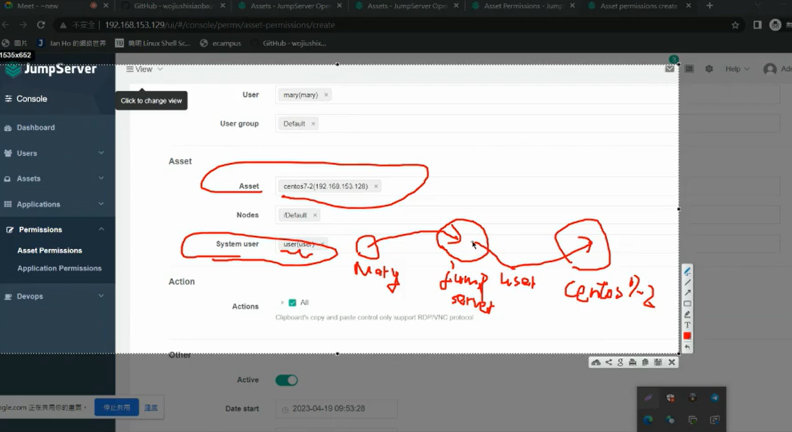  
> mary 透過 jumpserver 連接到centos7-2(透過user設定)


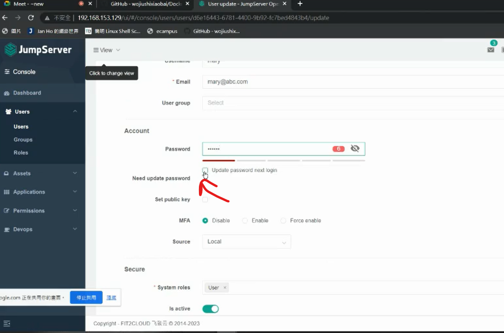  
> 去掉打勾才不會叫你重新設定密碼

登入mary 需要打勾
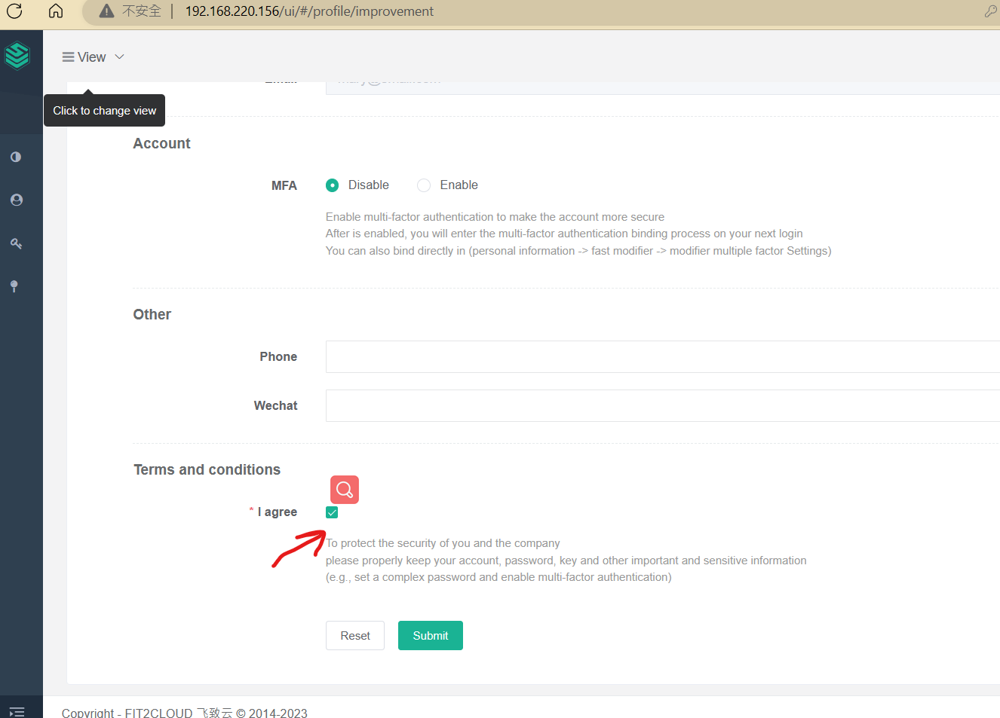  

submit之後重新登入
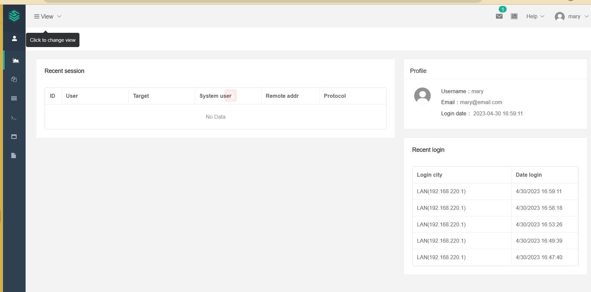  
> 就可以看到左側導航欄多了壹些東西

選擇web terminal
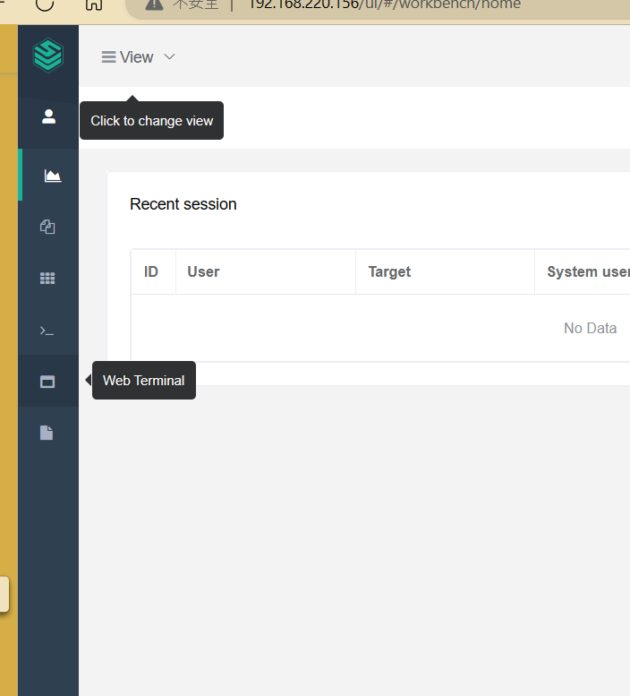  

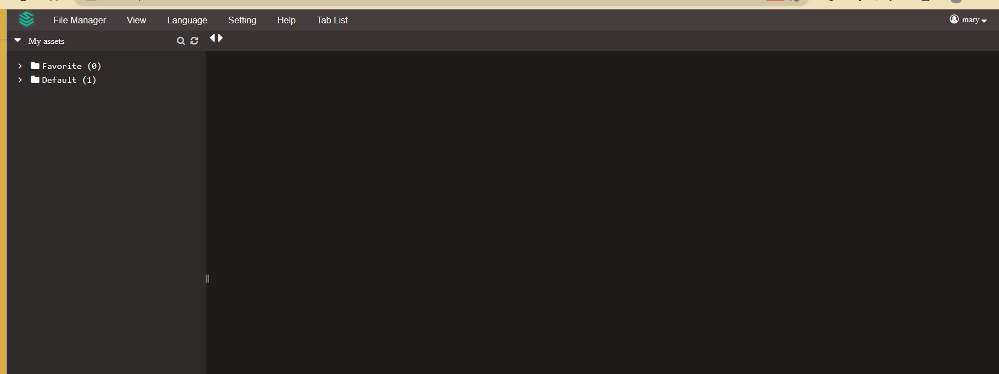  
> 可以看到以上介面

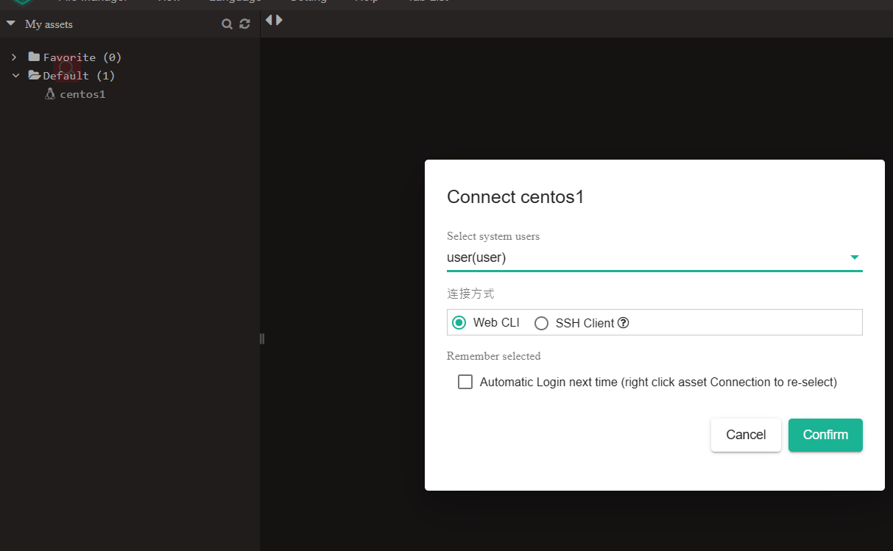  
> 選擇剛剛創建的centos1,web方式與ssh方式(能使用puppy)

按下comfirm
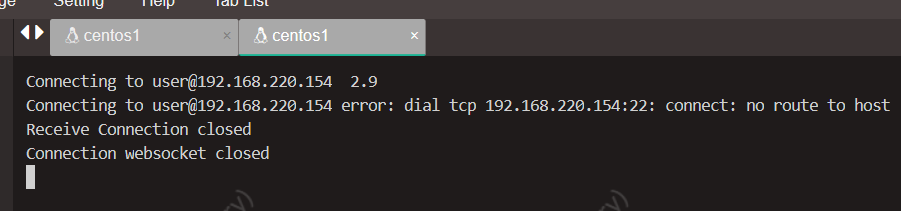  
> 我的ip好像改錯了...

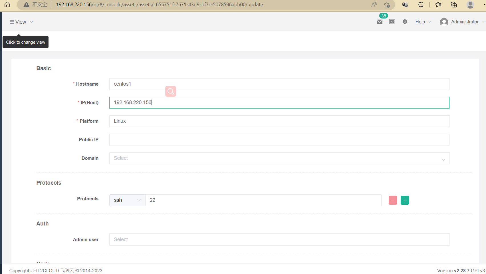  
> 修改asset IP 改成我現在虛擬機的ip 如果你的正確那就不用改

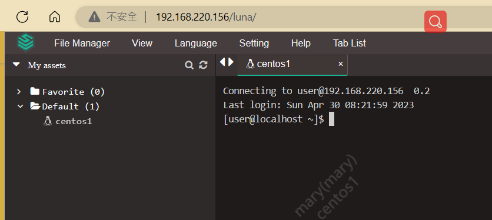  
> 實現了mary使用 jumpServer登入到user帳號

