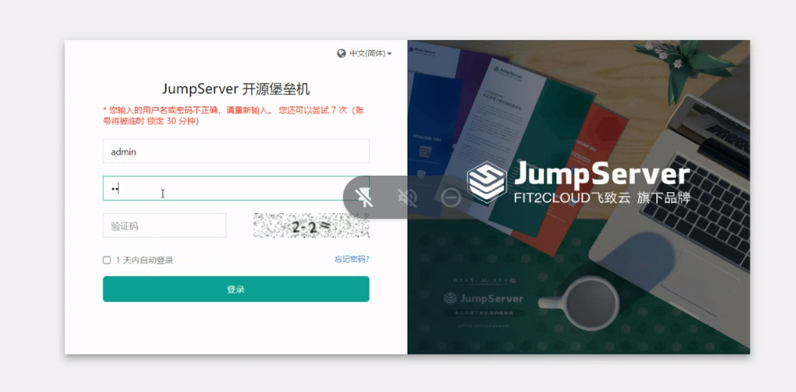
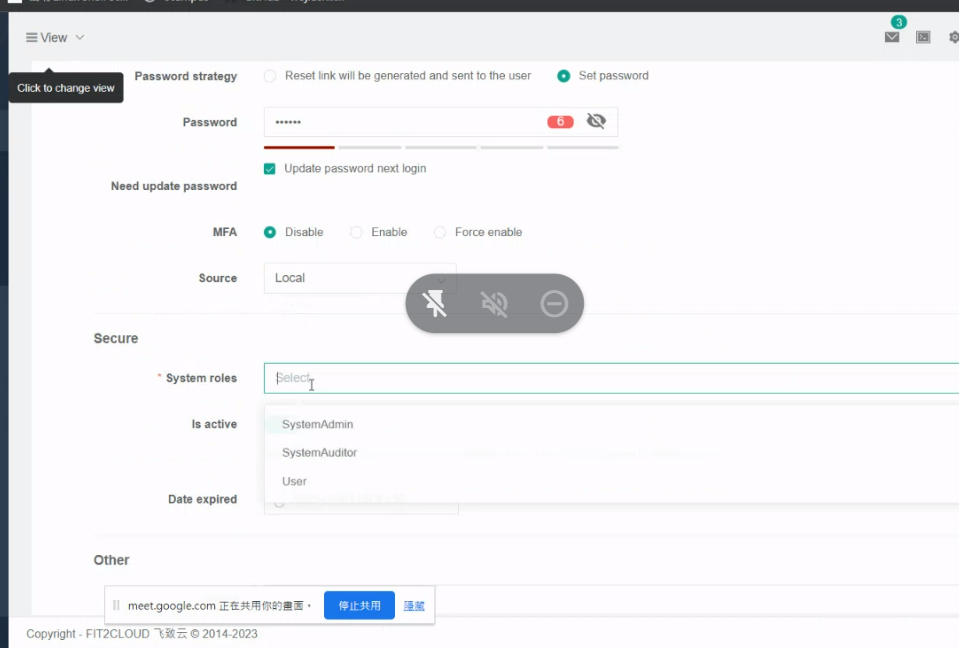
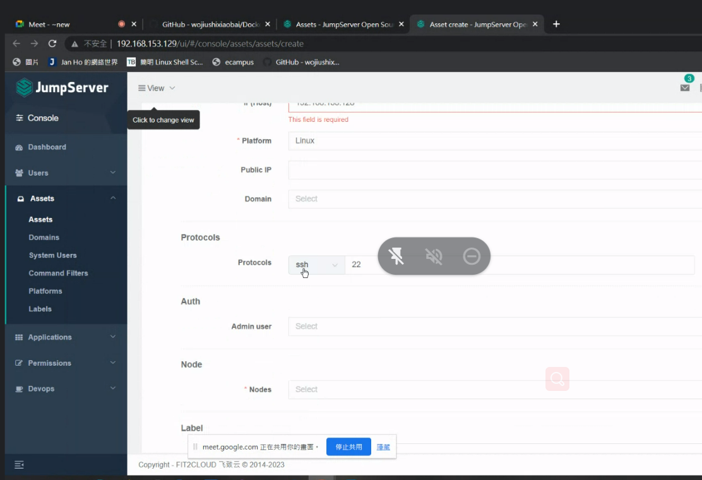
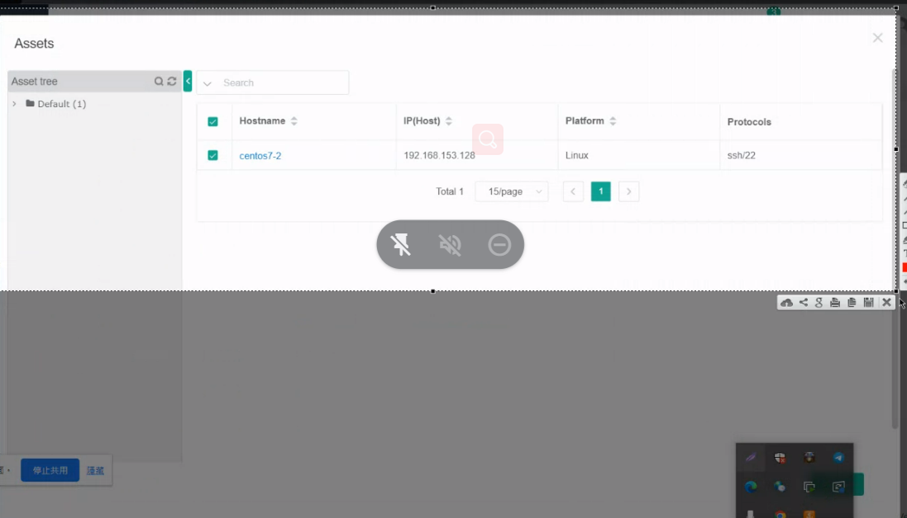
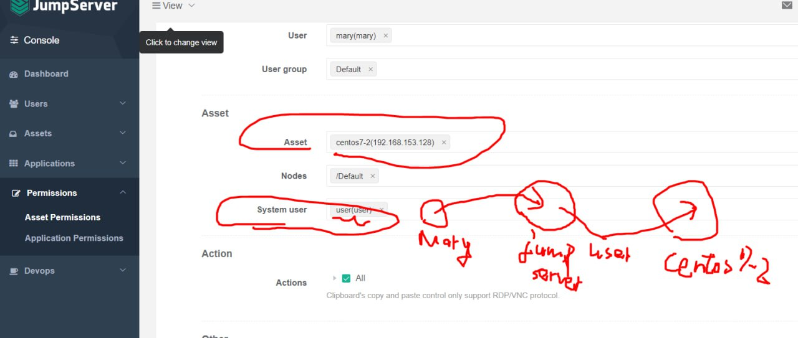
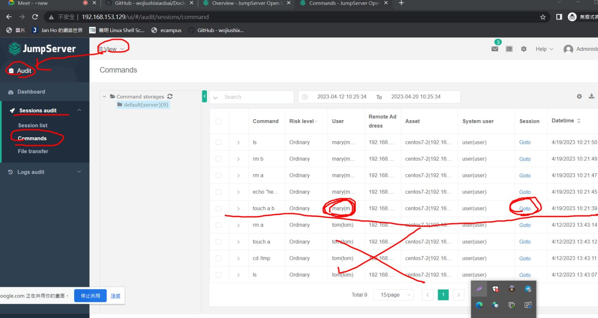
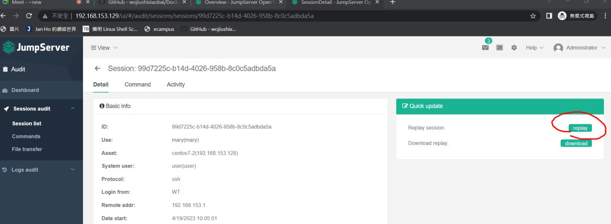
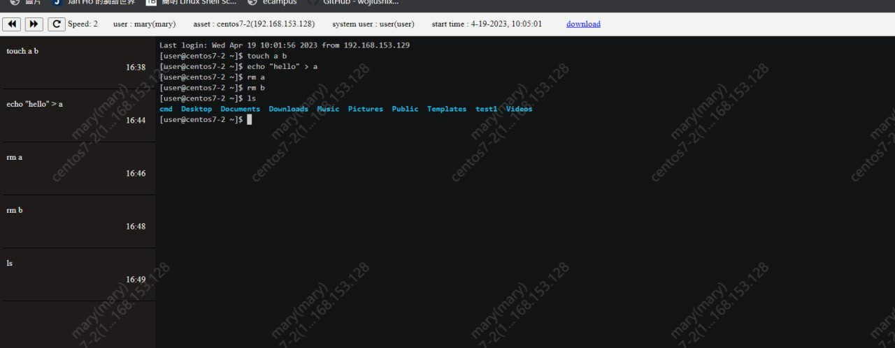

JumpServer

製作前要先啟動docker

Tutorial:
```
https://github.com/wojiushixiaobai/Dockerfile
```

  

設置堡壘機 使用者
  

設置asset
  

先設定Asset再設定user (Command User)

Permission要勾
  

  

凡走過必留下痕跡，JumpServer會記錄下我的惡行!!

查看操作影片
  

  

  


